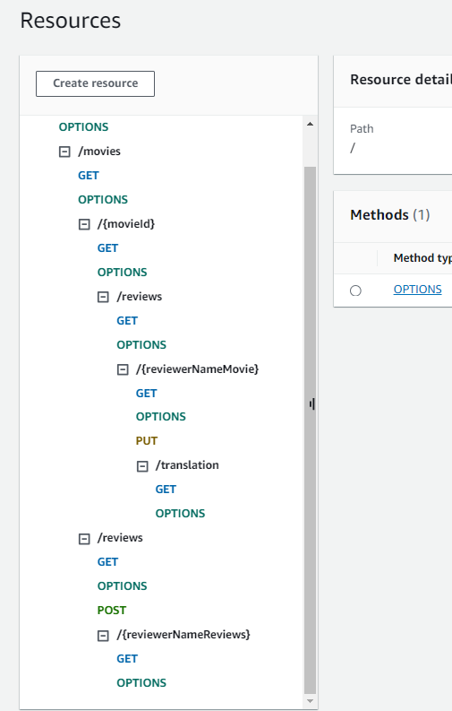

## ServerlessREST Sddignment - Distributed Systems.

__Name:__ .... Jack Duggan .....

This repository contains the implementation of a serverless REST API for the AWS platform. A CDK stack creates the infrastructure. The domain context of the API is movie reviews.

### API endpoints.
+ POST /movies/reviews - add a movie review.
+ GET /movies/{movieId}/reviews - Get all the reviews for a movie with the specified id.
+ GET /movies/{movieId}/reviews?minRating=n - Get all the reviews for the movie with the specified ID with a rating greater than the minRating.
+ GET /movies/{movieId}/reviews/{reviewerName} - Get the review for the movie with the specified movie ID and written by the named reviewer.
+ GET /movies/reviews/{reviewerName} - Get all the reviews written by a specific reviewer

I spent substantial time trying to get both
GET /movies/{movieId}/reviews/{year} & PUT /movies/{movieId}/reviews
working, but to no avail. The code is still project relevant, so I left it in, in case there are any marks available.

[Include screenshots from the AWS console (API Gateway service) that clearly show the deployed API ( have legible font size). ]

### Authentication..

Didn't get authentication working.

### Independent learning (If relevant).

I followed tutorial at https://completecoding.io/typescript-translation-api/ in an attempt to get translate functionality working.
Ultimately, I couldn't get it to work after spending hours trying.

Get the review for the movie with the specified movie ID and written by the named reviewer.

Get all the reviews written by a specific reviewer.

State any other evidence of independent learning achieved while completing this assignment.

